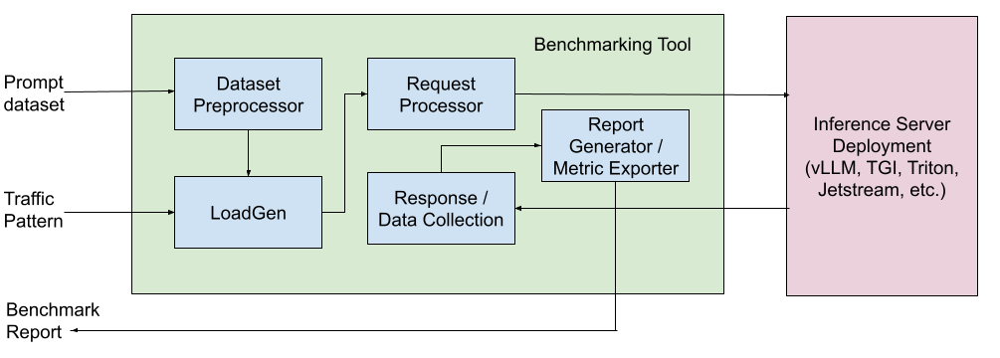

# Inference Perf

## Overview

This document is a WG Serving subproject proposal for a GenAI benchmarking tool
called `inference-perf`. The initial proposal on this tool’s design can be found
[here](https://docs.google.com/document/d/1k4Q4X14hW4vftElIuYGDu5KDe2LtV1XammoG-Xi3bbQ/edit?tab=t.0#heading=h.tr95yis8nefx)
and the follow-up discussions about the different options we have to support
this can be found in [WG-Serving: Benchmarking Tool Discussion](https://docs.google.com/document/u/0/d/15XSF8q4DShcXIiExDfyiXxAYQslCmOmO2ARSJErVTak/edit).

## Ownership

This is a joint effort that is being led by Google, IBM, and Red Hat with
project owners from each of the organizations:

*   [achandrasekar](https://github.com/achandrasekar)
*   [wangchen615](https://github.com/wangchen615)
*   [terrytangyuan](https://github.com/terrytangyuan)

## Motivation

With the advent of GenAI workloads serving on Kubernetes, there is a need to
measure the performance of these serving workloads in the context of being able
to measure the model server performance, accelerator performance, and Kubernetes
orchestration performance (autoscaling, load balancing, etc.) in a way that is
agnostic to the infrastructure and serving stack.

### Goals

Based on the feedback and the followup discussions, we’ve identified the
following goals we want to achieve with this benchmarking tool.

1. This benchmark-as-code tool can be used as a library and should provide
orchestration capabilities. It will be helpful to anyone who wants to measure
the performance of their model server or accelerator and quickly launch
different load testers for varying use cases for benchmarking purposes. The
orchestrator tool should be extensible so that it can be extended to incorporate
different load generation mechanisms, supporting popular APIs, and be run
locally, as a container or on a Kubernetes cluster.
2. The tool should be model server agnostic, so it can be run against any model
servers running on any accelerators as long as it has an endpoint that can be
used to send inference requests and supports an HTTP / gRPC API.
3. The project comes with specifications/standards to mount/download testing
load data, and export raw request data, performance data, and formats of
benchmarking results.
4. Generate different traffic patterns to be able to use it to benchmark
autoscaling with different load patterns, benchmark LoRA use cases with instance
gateway, etc.

### Non-Goals

1. Benchmark-as-tool similar to web benchmarks and other load testing tools to
provide a black box tool.
2. Generic benchmarking tool to benchmark use cases outside of GenAI serving.
GenAI workloads require specific things like token level metrics for LLMs,
streaming support for long running requests, etc. and keeping the tool focussed
on it helps keep it simple and makes it easier to use as well as useful.

## Evaluation of Existing Tools

We evaluated the existing benchmarking tools which try to achieve one or more of the above goals. The detailed evaluation can be found below. The ones marked in bold are required features to achieve our goals.

<table>
  <tr>
   <td style="background-color: #c9daf8">Features
   </td style="background-color: #c9daf8">
   <td style="background-color: #c9daf8"><a href="https://github.com/fmperf-project/fmperf">fmperf</a>
   </td>
   <td style="background-color: #c9daf8"><a href="https://github.com/GoogleCloudPlatform/ai-on-gke/tree/main/benchmarks/benchmark/tools/profile-generator">latency-profile-generator</a>
   </td>
   <td style="background-color: #c9daf8"><a href="https://github.com/triton-inference-server/perf_analyzer/blob/main/genai-perf/README.md">genai-perf</a>
   </td>
   <td style="background-color: #c9daf8"><a href="https://github.com/vllm-project/vllm/blob/main/benchmarks/benchmark_serving.py">vllm-benchmark</a>
   </td>
   <td style="background-color: #c9daf8"><a href="https://github.com/openshift-psap/llm-load-test">llm-load-test</a>
   </td>
  </tr>
  <tr>
   <td><strong>Benchmark as code (can be used as a library)</strong>
   </td>
   <td>Yes
   </td>
   <td>Yes (requires change)
   </td>
   <td>Yes (requires changes)
   </td>
   <td>Yes (requires changes)
   </td>
   <td>Yes (requires changes)
   </td>
  </tr>
  <tr>
   <td><strong>Multiple model server support</strong>
   </td>
   <td>Yes (vLLM, TGIS)
   </td>
   <td>Yes (vLLM, Triton, TGI, Jetstream)
   </td>
   <td>Partial (Triton, NIM)
   </td>
   <td>Partial (vLLM, TGI)
   </td>
   <td>Yes (vLLM, TGIS, HF-TGI, Caikit)
   </td>
  </tr>
  <tr>
   <td><strong>Extensible to support new model server</strong>
   </td>
   <td>Model server agnostic
   </td>
   <td>Model sever agnostic
   </td>
   <td>Hardest to extend
   </td>
   <td>Second hardest to extend
   </td>
   <td>Model server agnostic
   </td>
  </tr>
  <tr>
   <td><strong>Benchmarking time control</strong>
   </td>
   <td>Yes
   </td>
   <td>Yes
   </td>
   <td>No
   </td>
   <td>No
   </td>
   <td>Yes
   </td>
  </tr>
  <tr>
   <td><strong>RPS support (along with various request rates)</strong>
   </td>
   <td>No (can be added) 
   </td>
   <td>Yes
   </td>
   <td>Yes
   </td>
   <td>Yes
   </td>
   <td>No (planned)
   </td>
  </tr>
  <tr>
   <td>Multi-user support (concurrency)
   </td>
   <td>Yes
   </td>
   <td>No in
   </td>
   <td>Yes
   </td>
   <td>No
   </td>
   <td>Yes
   </td>
  </tr>
  <tr>
   <td>Containerization
   </td>
   <td>Yes
   </td>
   <td>Yes
   </td>
   <td>No
   </td>
   <td>No
   </td>
   <td>Yes
   </td>
  </tr>
  <tr>
   <td><strong>Run inside a K8s cluster</strong>
   </td>
   <td>Partial (Requires steps to create and mount prompt file alongside model weights via host machine)
   </td>
   <td>Yes
   </td>
   <td>No
   </td>
   <td>No
   </td>
   <td>Yes
   </td>
  </tr>
  <tr>
   <td>Tokenization / token level metrics
   </td>
   <td>Yes (only supports server side now, would require model server level changes)
   </td>
   <td>Yes (client side)
   </td>
   <td>Yes
   </td>
   <td>Yes
   </td>
   <td>Yes (client side)
   </td>
  </tr>
  <tr>
   <td>Dataset support
   </td>
   <td>Yes (quac)
   </td>
   <td>Yes (sharegpt)
   </td>
   <td>Yes (openorca, cnn_dailymail)
   </td>
   <td>Yes (sharegpt, sonnet, etc.)
   </td>
   <td>Yes (openorca, code_alpaca, pluggable)
   </td>
  </tr>
  <tr>
   <td>Streaming requests
   </td>
   <td>Yes
   </td>
   <td>No
   </td>
   <td>Yes
   </td>
   <td>Yes
   </td>
   <td>Yes
   </td>
  </tr>
  <tr>
   <td>Pulling metrics from GPU
   </td>
   <td>Yes
   </td>
   <td>No (Can be added)
   </td>
   <td>Yes
   </td>
   <td>No
   </td>
   <td>No
   </td>
  </tr>
  <tr>
   <td>Pulling metrics from model server
   </td>
   <td>No (Can be added)
   </td>
   <td>Yes
   </td>
   <td>No
   </td>
   <td>No
   </td>
   <td>No
   </td>
  </tr>
  <tr>
   <td>Multi-model support for LoRA benchmarking
   </td>
   <td>No (Can be added)
   </td>
   <td>Yes
   </td>
   <td>Yes 
   </td>
   <td>No
   </td>
   <td>No
   </td>
  </tr>
  <tr>
   <td>Deploy inference server / cluster (Ochestrator)
   </td>
   <td>Yes (via code)
   </td>
   <td>Yes (via terraform)
   </td>
   <td>No
   </td>
   <td>No
   </td>
   <td>No
   </td>
  </tr>
  <tr>
   <td>Support running outside of Kubernetes
   </td>
   <td>No
   </td>
   <td>Yes
   </td>
   <td>Yes
   </td>
   <td>Yes
   </td>
   <td>Yes
   </td>
  </tr>
</table>

From the above evaluation and follow-up discussions with the maintainers of the
above projects, we have reached a consensus on building this GenAI benchmark as
a code tool as a K8s subproject which would borrow from existing tools like
[fmperf](https://github.com/fmperf-project/fmperf) and
[latency-profile-generator](https://github.com/GoogleCloudPlatform/ai-on-gke/tree/main/benchmarks/benchmark/tools/profile-generator) to provide a standard and model server / infrastructure agnostic way to benchmark different GenAI workloads.

## Proposal

### Design

This section describes the high level design for the tool. It includes the
following components.

#### Dataset Preprocessor

Dataset Preprocessor takes in a known dataset like ShareGPT or OpenOrca as the
input and pre-processes them by making sure the prompt length and generation
length are aligned with the user input to support different options like fixed
input / output length tests, variable length tests (larger input / smaller
output and the vice versa). This allows us to support different GenAI use cases
like chat completion, summarization, code completion, etc. depending on the
dataset and the benchmarking user’s inputs.

#### LoadGen

LoadGenerator is the component which generates different traffic patterns based
on user input. This can include a fixed RPS test for a predetermined amount of
time or include a way to generate bursts in traffic or other traffic patterns as
desired for autoscaling and other use cases.

#### Request Processor

Request Processor provides a way to support different model servers and their
corresponding request payload with different configurable parameters. This makes
our tool model server agnostic and provides a generic way to benchmark different
model servers and produce apples to apples comparison between them. This
component will also support different protocols like http and grpc and options
like request streaming which is important to produce time to first token (TTFT)
metric.

#### Response Processor / Data Collector

Response Processor / Data Collector component allows us to process the response
and measure the actual performance of the model server in terms of request
latency, TPOT, TTFT and throughput.

#### Report Generator / Metrics Exporter

Report Generator / Metrics Exporter generates a report based on the data
collected during benchmarking. It can also export the different metrics that we
collected during benchmarking as metrics into Prometheus which can then be
consumed by other monitoring or visualization solutions.

### Metrics to Collect

The following are the essential metrics that we want to collect using the
benchmarking tool.

*   Throughput
    *   Output tokens / second
    *   Input tokens / second
    *   Requests / second
*   Latency at different percentiles (mean, median, p90, p99)
    *   Time per output token (TPOT)
    *   Time to first token (TTFT)
    *   Time per request

Optionally we also want to collect specific accelerator and model server metrics.

*   Accelerator metrics
    *   Accelerator utilization (duty cycle)
    *   Accelerator memory utilization
    *   Accelerator memory bandwidth utilization
    *   Accelerator power usage
*   Model server metrics
    *   Batch size
    *   Queue size
    *   KV cache usage

### Organization

* We will create a new k8s subproject under [kubernetes-sigs](https://github.com/kubernetes-sigs) org. 
* We are looking at SIG Scalability to sponsor this subproject.